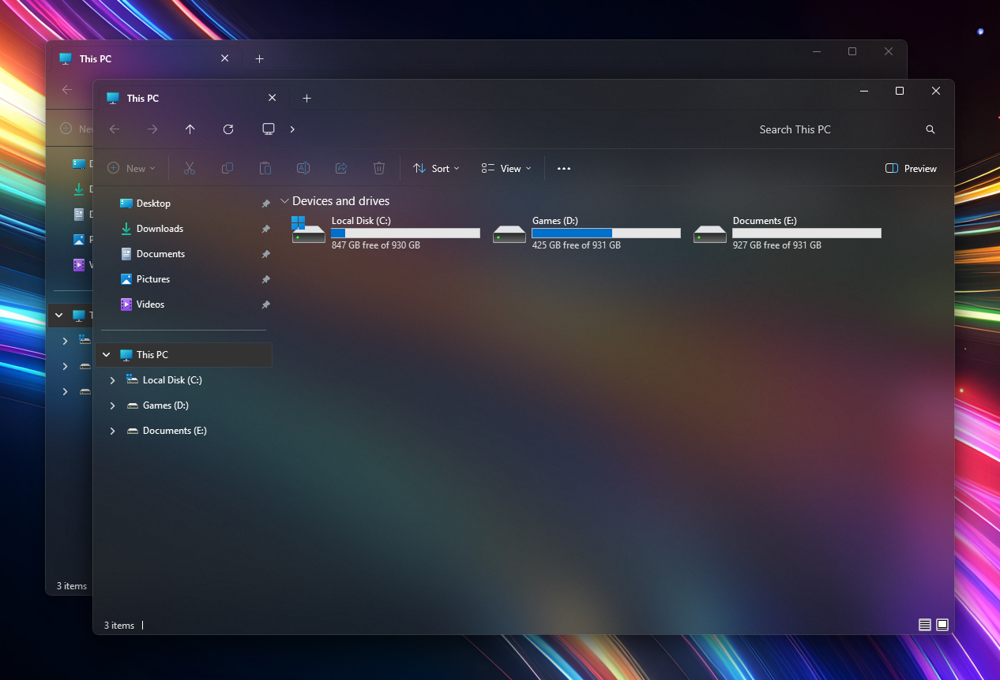
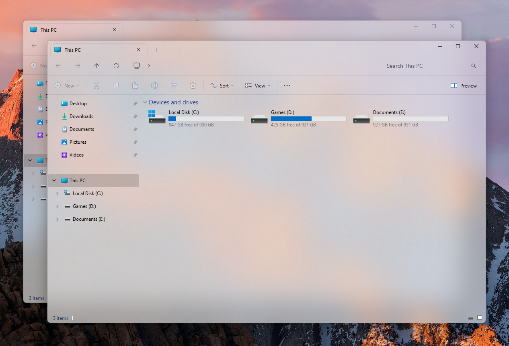
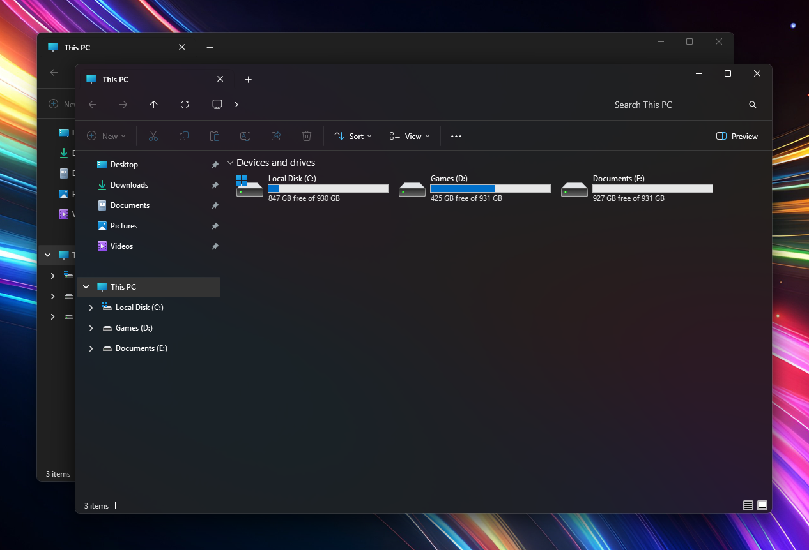
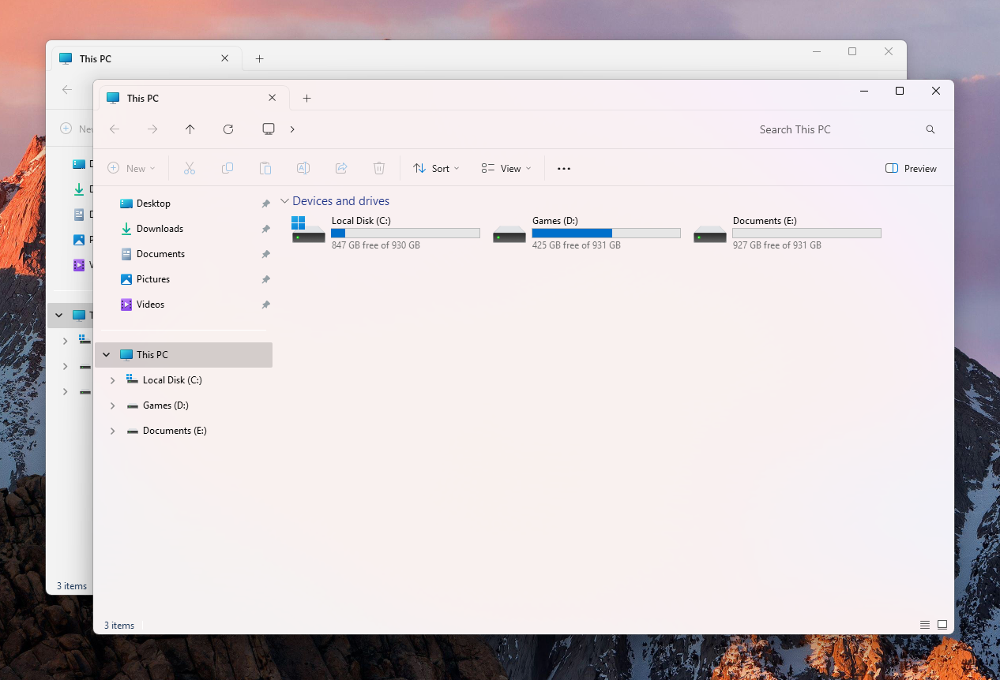
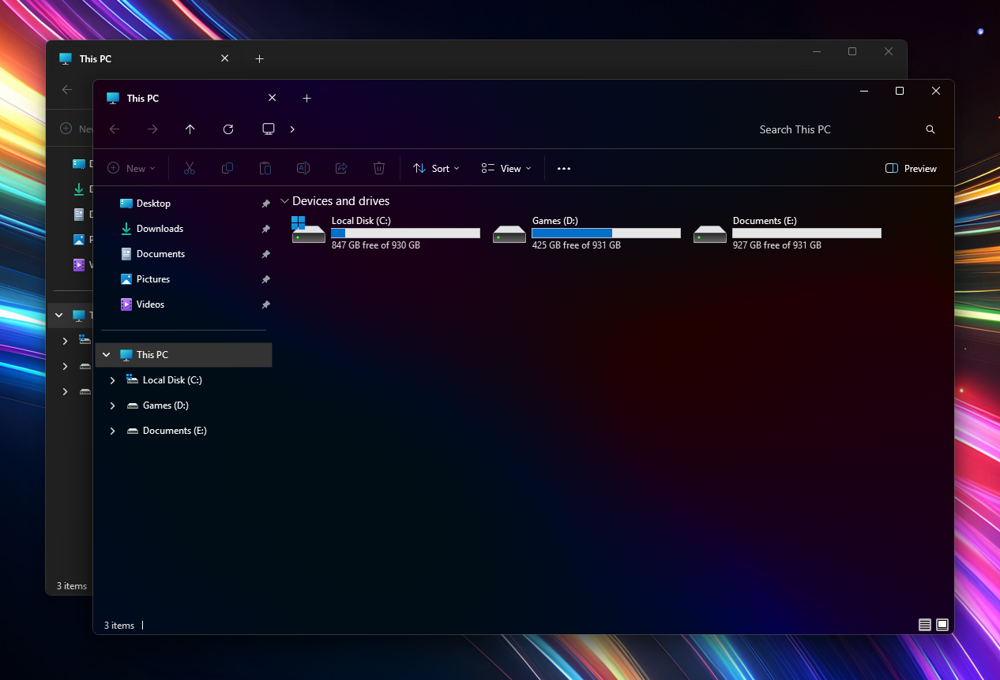
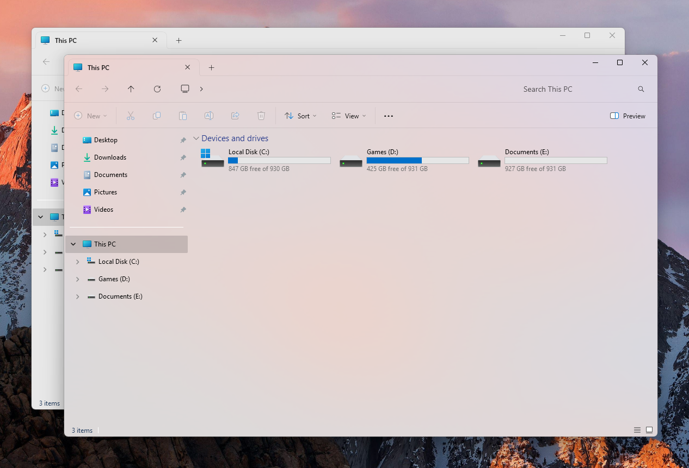

> **Notice:** The Mica4U project has been archived. For alternative tools to apply Mica and Acrylic effects to Windows Explorer, please consider the following:
> - [ExplorerBlurMica](https://github.com/Maplespe/ExplorerBlurMica)
> - [MicaForEveryone](https://github.com/MicaForEveryone/MicaForEveryone)
> - [DWMBlurGlass](https://github.com/Maplespe/DWMBlurGlass)
> - [Windhawk](https://windhawk.net/)

<p align="center"></p>
<p align="center">
  <a href="https://www.gnu.org/licenses/lgpl-3.0"></a>
  <a href="https://github.com/DRKCTRLDEV/Mica4U/releases"></a>
  <a href="https://github.com/DRKCTRLDEV/Mica4U/stars"></a>
  <a href="https://github.com/DRKCTRLDEV/Mica4U/releases"></a>
  
</p>
<h3 align=center><u>Efficient & User-Oriented</u> software used to apply Mica, & Acrylic effects to Windows Explorer.</h3>
<h2 align=center>Overview & Information</h2>

> **Notice:** This software is provided "as is" and without warranty of any kind. Use at your own risk  
> **Support:** This software is actively developed for use with Windows 10, & 11

Mica4U is a user-friendly PyQt6-based interface for Maplespe's ExplorerBlurMica project, designed to apply Mica and Acrylic visual effects to Windows Explorer. It offers many features, including a color preset management system, QuickSwitch functionality for real-time modifications, and a sleek, intuitive user interface. As the lightest Explorer theming tool available, Mica4U combines performance with aesthetic appeal. The software benefits from active development, with major updates typically released every one to two weeks and prompt resolution of bugs or issues. Users are encouraged to submit feature requests or report issues via the project's GitHub repository to contribute to its ongoing improvement.

### Key Features
- **Color Preset Management System**: Enables users to create, save, and apply custom color profiles for personalized theming.
- **QuickSwitch Functionality**: Facilitates real-time toggling of visual effects for immediate customization.
- **Sleek, Intuitive User Interface**: Provides a modern and accessible design for seamless user interaction.
- **Lightweight Design**: Ensures minimal system resource usage while delivering robust theming capabilities.

### Development and Community
- **Active Development**: Regular updates, typically every one to two weeks, introduce new features and enhancements.
- **Prompt Support**: Bugs and issues are addressed swiftly to maintain a reliable user experience.
- **Community Engagement**: Users are invited to contribute ideas or report issues via the [GitHub repository](https://github.com/DRKCTRLDEV/Mica4U).


<h2 align=center>Screenshots</h2>
  
  
  <div align=center><details>
    <summary><u>View More Screenshots</u></summary>
    
    
    
    
  </details></div>

<h2 align=center>Planned Updates</h2>

- [ ] Add support for theming additional Windows components beyond Explorer (e.g., Settings app, other system UI elements, etc..) 
- [ ] Integrate support for Maplespe's ExplorerTool (used to add images to the Explorer UI)
- [x] Ongoing UI/UX improvements and new color preset features
- [ ] Performance optimizations and bug fixes (Primarily bug fixes until next major update)

<h2 align=center>Install/Uninstall</h2>

### Installation

1. **Download the Latest Release**
   - Go to the [Releases page](https://github.com/DRKCTRLDEV/Mica4U/releases) and download the latest `Mica4U` installer (`.exe`).
2. **Run the Installer**
   - Double-click the downloaded installer and follow the on-screen instructions.
   - The installer will automatically place all necessary files and create shortcuts if selected.
3. **Requirements**
   - Windows 10 or 11 (64-bit)
   - No additional dependencies required; all necessary components are bundled.

### Portable Mode
- You can also use the portable version by extracting the release `.zip` and running `Mica4U.exe` directly. No installation is required.

### Uninstallation

- **If Installed via Installer:**
  1. Open the Windows *Settings* app or *Control Panel*.
  2. Navigate to *Apps* > *Installed apps* (or *Programs and Features*).
  3. Find **Mica4U** in the list, select it, and click **Uninstall**.
  4. Follow the prompts to remove the application.
- **If Using Portable Version:**
  - Simply delete the extracted folder to remove all files.
  - **Important:** Before deleting the portable folder to uninstall, ensure you have unregistered the DLL from within Mica4U (use the  "Uninstall" option). This prevents file locking (inability to delete).

> **Note:** Custom settings and presets are stored in the application's directory or `%APPDATA%/Mica4U`. Delete these folders if you wish to remove all user data. (Or click 'Yes' to cleaning up setttings in the uninstaller)

<h2 align=center>Build From Source</h2>

### Prerequisites
- **Python 3.12+** ([python.org](https://www.python.org/))
- **pip** (comes with Python)
- **PyQt6** and **PyInstaller**

### Steps
1. **Clone the Repository**
   ```sh
   git clone https://github.com/DRKCTRLDEV/Mica4U.git
   cd Mica4U
   ```
2. **Install Dependencies**
   ```sh
   pip install -r requirements.txt
   # Or manually:
   pip install PyQt6 PyInstaller
   ```
3. **Build the Executable**
   ```sh
   ./build.ps1
   # Or manually:
   pyinstaller build/Mica4U.spec
   ```
   The executable(s) will be in `build/output/`.
   > **Versioning:** You can specify a version as an argument: `./build.ps1 x.x.x`

4. **Run the Application**
   For development, launch `main.py`:
     ```sh
     python main.py
     ```
     > **Note:** To use in this form, you must run as administrator and have a `portable.ini` file in the same directory. You can also build the portable version and substitute `Mica4U.exe` with `main.py`, but this will not auto-elevate.
   Or run the built executable from `build/output/`.

<h2 align=center>License & Credits</h2>

- Licensed under [LGPL v3](https://www.gnu.org/licenses/lgpl-3.0)
- Constructed with [Python 3.12.0](https://www.python.org/), [PyQt6 6.9.0](https://pypi.org/project/PyQt6/), [PyInstaller 6.13.0](https://pypi.org/project/PyInstaller/), & [InnoSetup 6.4.3](https://jrsoftware.org/)
- SVG icons provided by [FontAwesome](https://fontawesome.com)
- Core XAML theming forked from [Maplespe](https://github.com/Maplespe)/[ExplorerBlurMica](https://github.com/Maplespe/ExplorerBlurMica) Project
- GUI & Automation coded by yours truly, [𝓓𝓡𝓚](https://github.com/DRKCTRLDEV)
